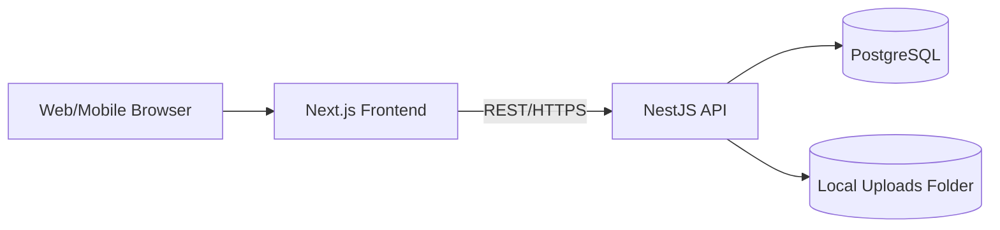

# 🏗️ Solution Architecture – RecipeWire (MVP)

> ออกแบบโดย Winston (System Architect)

## 0) One-Page Summary

- **Mission:** เว็บแอปแชร์สูตรอาหารที่ใช้งานง่าย พร้อมค้นหา/กรอง และรีวิว/ให้คะแนน

- **MVP Stack:**
  - **Frontend:** Next.js (React) **+ TypeScript** + Tailwind CSS + **shadcn/ui**
  - **Backend:** Node.js (NestJS, REST) **+ TypeScript** + **Zod** validation + **JWT** Auth
  - **DB:** **PostgreSQL** (pg/Prisma)
  - **Storage:** **โฟลเดอร์อัปโหลดบนเซิร์ฟเวอร์** (เช่น `/var/app/uploads`) สำหรับรูปสูตร/โปรไฟล์
  - **Search (MVP):** **PostgreSQL** (Full-Text Search)
  - **Infra:** **Docker + Docker Compose** (dev/prod)
  - **Obs:** **Basic app logs เท่านั้น**

- **Security:** ตาม **OWASP Top 10**, JWT (short TTL + refresh), validation ทุกชั้น

---

## 1) Goals & Scope (จาก PRD/MVP)

- Auth (สมัคร/เข้าสู่ระบบ, โปรไฟล์)
- Recipe CRUD (ชื่อ, ส่วนผสม, ขั้นตอน, เวลา, รูปภาพ)
- Search/Filter (ชื่อเมนู, ประเภท, เวลา; Phase 2: dietary)
- Reviews & Ratings (⭐1–5 + ข้อความ)
- Responsive UI (มือถือ/เดสก์ท็อป)

**Non-Goals (MVP):** Social follow, gamification, AI suggestion, marketplace (ไป Phase 2+)

---

## 2) Context Diagram



---

## 3) Logical Architecture

### 3.1 Frontend (Next.js)

- **Language:** TypeScript (strict: true)
- Pages/Routes: `/`, `/signup`, `/login`, `/dashboard`, `/recipes/:id`, `/recipes/new`, `/search`
- Components: RecipeCard, RecipeForm (dynamic ingredients/steps), Filters, RatingWidget, ReviewList
- State Mgmt: React Query (server-state), Zustand (UI state)
- UI Kit: **shadcn/ui**
- Accessibility: WAI-ARIA (ยึดตาม wiref### 3.2 API (NestJS, REST)
- **Language:** TypeScript (strict type checking)
- Layers: Controller → Service → Repository (Prisma) + DTO Validation (Zod)
- Middlewares: AuthGuard (JWT), RequestId, Logging
- Modules: Auth, Users, Recipes, Reviews, Search, **Media (local uploads)**, Admin (ภายหลัง)

### 3.3 Data & Storageviews, Search, **Media (local uploads)**, Admin (ภายหลัง)

### 3.3 Data & Storage

- PostgreSQL เป็นแหล่งข้อมูลหลัก
- รูปเก็บใน **โฟลเดอร์บนเครื่องเซิร์ฟเวอร์** เช่น `/var/app/uploads` และเก็บพาธไฟล์ใน DB
- **ไม่มี Redis/คิวงานใน MVP**; การคำนวณค่าเฉลี่ยเรตติ้งใช้ **DB trigger** หรือคิวภายในโปรเซสชั่วคราว (ถ้าจำเป็น) แทน

### 3.4 Project Structure (Monorepo – Current)

```
recipe-wire/
├── apps/
│   ├── frontend/          # Frontend app (Next.js + TS + shadcn/ui – app-local)
│   └── backend/           # Backend API (NestJS + TS + Prisma)
├── packages/              # Shared code
│   ├── types/             # TypeScript types & Zod schemas (DTO/Contract)
│   ├── utils/             # Shared utilities (พิจารณาแยก utils-web / utils-node หากมีของเฉพาะ runtime)
│   └── ui/                # Shared UI components (เฉพาะที่ generic จริง ๆ)
├── package.json           # Root workspace config
```

**Guidelines & Boundaries**

- **shadcn/ui**: ติดตั้งและคอนฟิกไว้ใน `apps/frontend` (app-local) เพื่อหลีกเลี่ยงปัญหา theme/tailwind/RSC; เฉพาะคอมโพเนนต์ที่ generic จริง ๆ ค่อยย้ายไป `packages/ui` ภายหลัง
- **Import Rules**: `apps/*` ห้ามอิมพอร์ตข้ามกัน, `apps/frontend` ห้ามใช้โค้ด Node-only, `apps/backend` ห้ามใช้โค้ด browser-only
- **Types/DTO**: เก็บ schema/ประเภทกลางที่ `packages/types` (Zod → infer TypeScript) แล้วใช้ร่วม FE/BE เพื่อลด mismatch
- **Build/Test**: แนะนำ workspaces (pnpm/yarn) + pipeline แยกต่อแอป; E2E tests แยกโฟลเดอร์ (`e2e/`) ได้ในอนาคต
- **Docker Context**: ตั้ง `.dockerignore` รายแอปเพื่อให้ image เล็กและ build เร็ว

---

## 4) Data Model (ERD)

```mermaid
erDiagram
  USERS ||--o{ RECIPES : owns
  USERS ||--o{ REVIEWS : writes
  RECIPES ||--o{ REVIEWS : receives
  RECIPES ||--o{ RECIPE_STEPS : ordered
  RECIPES ||--o{ RECIPE_INGREDIENTS : has
  CATEGORIES ||--o{ RECIPE_CATEGORIES : maps
  DIETARY_TAGS ||--o{ RECIPE_DIETARY : maps

  USERS {
    uuid id PK
    text email UNIQUE
    text password_hash
    text display_name
    text avatar_url
    text bio
    timestamptz created_at
  }
  RECIPES {
    uuid id PK
    uuid owner_id FK -> USERS.id
    text title
    text cover_image_url
    int cook_time_minutes
    text description
    timestamptz created_at
    timestamptz updated_at
    numeric avg_rating default 0  // denormalized for fast reads
    int ratings_count default 0
    boolean is_published default true
  }
  RECIPE_STEPS {
    uuid id PK
    uuid recipe_id FK -> RECIPES.id
    int step_number
    text instruction
  }
  RECIPE_INGREDIENTS {
    uuid id PK
    uuid recipe_id FK -> RECIPES.id
    text label // e.g., "ไข่ 2 ฟอง"
  }
  REVIEWS {
    uuid id PK
    uuid recipe_id FK -> RECIPES.id
    uuid user_id FK -> USERS.id
    int rating check 1..5
    text comment
    timestamptz created_at
    UNIQUE (recipe_id, user_id)
  }
  CATEGORIES {
    smallint id PK
    text name UNIQUE // ของหวาน, อาหารเช้า, จานหลัก
  }
  RECIPE_CATEGORIES {
    uuid id PK
    uuid recipe_id FK -> RECIPES.id
    smallint category_id FK -> CATEGORIES.id
    UNIQUE (recipe_id, category_id)
  }
  DIETARY_TAGS {
    smallint id PK
    text code UNIQUE // VEG, GF, etc (Phase 2)
  }
  RECIPE_DIETARY {
    uuid id PK
    uuid recipe_id FK -> RECIPES.id
    smallint tag_id FK -> DIETARY_TAGS.id
    UNIQUE (recipe_id, tag_id)
  }
```

**หมายเหตุ:**

- `avg_rating` และ `ratings_count` อัปเดตผ่าน DB trigger หรือ background job เพื่อเร็วในหน้า list
- Full-text search indexes: `recipes(title, description)`, trigram index สำหรับ title (ILIKE)

---

## 5) API Design (MVP)

**Auth**

- `POST /v1/auth/signup` {email, password, displayName}
- `POST /v1/auth/login` {email, password} → {accessToken, refreshToken}
- `POST /v1/auth/refresh` {refreshToken}

**Users**

- `GET /v1/me` (JWT)
- `PATCH /v1/me` (displayName, avatarUrl, bio)

**Recipes**

- `POST /v1/recipes` (JWT) – create
- `GET /v1/recipes/:id` – read
- `PATCH /v1/recipes/:id` (owner) – update
- `DELETE /v1/recipes/:id` (owner) – delete
- `GET /v1/recipes` – list (query: `q`, `category`, `maxTime`, `sort` = popular|latest|time)

**Media (Local Uploads)**

- `POST /v1/uploads` (JWT, multipart/form-data: `file`) – เซฟไฟล์ลงโฟลเดอร์เซิร์ฟเวอร์ → คืน URL/พาธสัมพัทธ์
  - **ข้อกำหนดไฟล์:** ประเภท `image/jpeg|png|webp`, **ขนาด ≤ 3 MB** (แนะนำ 2–3 MB)
  - **ลิมิตต่อสูตร:** รวม **5–10 รูป/สูตร** (บังคับ **1 รูปหลัก** + รูปเสริม 4–9)

**Reviews**

- `POST /v1/recipes/:id/reviews` (JWT) – rating 1–5 + comment
- `GET /v1/recipes/:id/reviews`

---

## 6) Search & Filtering

- **MVP:** ใช้ **Postgres FTS** (`tsvector` ของ title/description) + กรอง `category`, `cook_time_minutes`
- **Sorting:** `popular` = `avg_rating DESC, ratings_count DESC`; `latest` = `created_at DESC`; `time` = `cook_time_minutes ASC`
- **Phase 2+:** อาจพิจารณา Meilisearch/OpenSearch หากต้องการความเร็ว/ไฮไลท์มากขึ้น

---

## 7) Authentication & Security

- **Auth:** JWT RS256 (access ~15m, refresh ~7d), password-hash: bcrypt/argon2
- **RBAC:** `user`, `admin` (อนาคต)
- **Validation:** Zod DTO + sanitize HTML (reviews/description) ป้องกัน XSS
- **CORS:** อนุญาตเฉพาะ origin ที่กำหนด; ใช้ JWT Bearer (ไม่ใช้ cookie → ไม่ต้อง CSRF token)
- **File Upload:**
  - ตรวจ `mimetype`/ขนาด (`≤ 3 MB` ต่อรูป) และบล็อก path traversal
  - บังคับโควตา **5–10 รูป/สูตร** (1 รูปหลัก + 4–9 รูปเสริม)
  - สร้างชื่อไฟล์ปลอดภัยและโฟลเดอร์แยกตาม user/recipe id

- **OAuth:** _ตัดออกใน MVP ตามการตัดสินใจ_
- **งด Rate Limit/Redis** ตามคำขอ (พิจารณาเพิ่มภายหลังหากเสี่ยง)

---

## 8) Frontend UX Mapping → Wireframe

- นำองค์ประกอบจากไฟล์ wireframe: Landing, Dashboard (Latest/Popular + Search bar), Create Form (dynamic list), Recipe View (ingredients/steps/reviews), Search page (filters)
- React components สอดคล้องกับ flow และ ARIA labels ใน wireframe

---

## 9) CI/CD & Environments

- **Dev:** Docker Compose (`frontend`, `api`, `db`, และ `uploads` bind mount)
- **Prod (MVP):** Docker Compose on single host (reverse proxy เช่น Nginx)
- **CI:**
  - Lint/Type check (ESLint/TypeScript)
  - Unit tests (Vitest/Jest)
  - API tests (supertest)
  - DB migration check (Prisma migrate)

- **CD:** สคริปต์ deploy ที่ดึง image จาก Registry แล้ว `docker compose up -d`
- **Secrets:** `.env` ไฟล์ที่เครื่อง/ตัวจัดการลับของโฮสต์

---

## 10) Observability & Quality

- **Logs:** JSON logs (pino) พร้อม RequestId (stdout → เก็บโดยโฮสต์/รีเวิร์สพร็อกซี)
- **Metrics:** _ตัดระบบ metrics/trace ออก_ ใน MVP; ตรวจเช็คด้วย health endpoints + log review
- **QA:** E2E (Playwright) สำหรับ core flows: sign up/login, create recipe, search, review

---

## 11) Risks & Mitigations

- **Content Quality:** เพิ่ม report/moderation (Phase 2), community guidelines
- **Competition:** เน้น UX เร็วและค้นหาแม่น, SEO (SSR), เวลาโหลดเร็ว (<2s First Contentful Paint)
- **Scalability:** เลือก stack ที่ horizontal scale ง่าย, ใช้ CDN + cache + async jobs

---

## 12) Implementation Checklist (MVP)

- [ ] สร้าง Next.js app + Tailwind + **shadcn/ui** + React Query
- [ ] NestJS API + Prisma + Postgres schema
- [ ] Auth: signup/login/refresh + JWT
- [ ] **Local uploads** endpoint + บริหารโฟลเดอร์ `/var/app/uploads`
- [ ] Recipe CRUD + search/list endpoint + filters + sorting (Postgres FTS)
- [ ] Reviews CRUD + **DB trigger** อัปเดต avg/rating count
- [ ] E2E tests (Playwright) สำหรับ 5 user flows หลัก
- [ ] **Docker Compose** dev/prod + logging baseline

---

## 13) Open Questions → **Resolved Decisions (MVP)**

- **OAuth (Google/Apple):** **ไม่รวมใน MVP**
- **นโยบายรูปภาพ:** **≤ 3 MB/ไฟล์**, **5–10 รูป/สูตร** (1 รูปหลัก + 4–9 รูปเสริม)
- **ลบข้อมูล:** **Hard delete** สำหรับสูตร/รีวิว
- **การเผยแพร่:** **อนุมัติอัตโนมัติ** เมื่อผู้ใช้กดเผยแพร่
